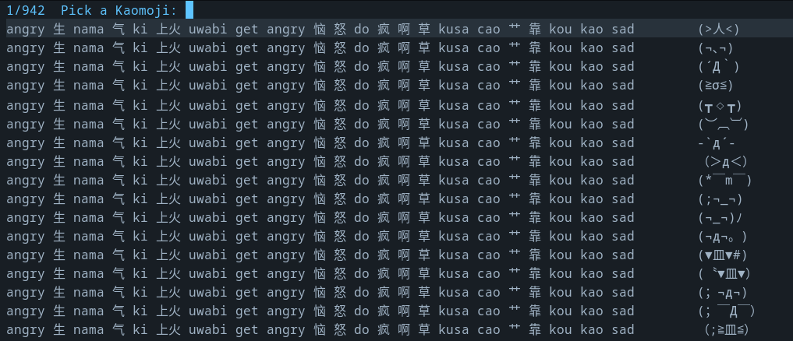

# Kaomel

A snappy kaomoji picker for Emacs.



## Description
The package `kaomel` is an Emacs package that provides easy insertion of kaomojis into your buffer. With a collection of almost 1000 kaomojis to choose from, you can quickly find the perfect expression to enhance your messages and documents. It offers two different commands for copying the kaomojis to the clipboard or inserting them directly into the buffer.

## Features
- [x] Interactive interface for selecting kaomojis.
- [x] Insert selected kaomoji at the current cursor position.
- [x] Copy selected kaomoji to the system clipboard.
- [x] Better tagging system;
- [x] Finer helm configuration;
- [x] Vertico support
- [x] Kana transliteration
- [x] Embedded dataset as vectorized elisp for speed.

## Installation

### Install manually
1. Clone the GitHub repository for the Emacs package using the `git clone` command:
```
git clone https://github.com/gicrisf/kaomel
```

2. Move the cloned package directory into your Emacs' load path, which is typically `~/.emacs.d/`:
```
mv kaomel ~/.emacs.d/
```

3. Open your Emacs configuration file, usually `~/.emacs.d/init.el` or `~/.emacs`:
```
emacs ~/.emacs.d/init.el
```

4. Add the package to your Emacs load path. Assuming that the repository has been moved to the path `~/.emacs.d/`:

```elisp
(add-to-list 'load-path "~/.emacs.d/kaomel")
```

5. Save the configuration file, then restart Emacs, or reload it.

Now, the package commands will be available and will load automatically when first used.

### Install with use-package

If you use `use-package`, you can follow steps 1-3 of the manual procedure and replace steps 4-5 with:

```emacs-lisp
(use-package kaomel :load-path "~/.emacs.d/kaomel")
```

Alternatively, you can skip all the previous steps entirely and install directly from the GitHub repository with:

```elisp
(use-package kaomel :vc (:fetcher github :repo "gicrisf/kaomel"))
```

This will automatically clone the repository and handle the installation for you.

### Install with Straight

```emacs-lisp
(straight-use-package
 '(kaomel :host github :repo "gicrisf/kaomel"
   :files ("*.el")))
```

This will clone the repository and build the package using straight.

### Install on Doom Emacs
For Doom Emacs users, add the following to your `packages.el` file:

```emacs-lisp
(package! kaomel :recipe (:host github :repo "gicrisf/kaomel"))
```

## Usage

### Basic Commands

**Insert kaomoji at cursor:**
```
M-x kaomel-insert
```

**Copy kaomoji to clipboard:**
```
M-x kaomel-to-clipboard
```

### How to Select Kaomojis

1. Run one of the commands above
2. A completion interface will open showing available kaomojis with their tags
3. Type to search/filter kaomojis by their tags or names
4. Use arrow keys to navigate through the results
5. Press `RET` (Enter) to select your desired kaomoji

### Interface Compatibility

The package automatically detects your completion framework:
- **Default**: Uses `completing-read` (works with Vertico, Ivy, etc.)
- **With Helm**: Automatically uses Helm interface when `helm-core` is available
- **Force completing-read**: Set `kaomel-force-completing-read` to `t` to always use completing-read

### Font Setup

For proper kaomoji rendering, ensure your Emacs font supports Unicode characters.

**In Doom Emacs:**

```emacs-lisp
:ui
(emoji +unicode)  ;; <= uncomment this!
```

### Configuration
This chapter provides documentation for several Emacs Lisp options available in the Kaomel package.

Option: `kaomel-force-completing-read`
(type: boolean, default value: nil)

By default, `kaomel` uses `completing-read` for interactive selection. However, if you have Helm installed, it will use Helm instead. If you still want to use `completing-read` even with Helm installed, you can enforce this by setting a specific variable.

```emacs-lisp
(setq kaomel-force-completing-read t)
```

Option: `kaomel-tag-langs`
(type: list, default values: "orig", "hepburn", "en")

This option determines the preferred languages in the displayed tags used by the Kaomel package. It accepts a list of strings representing the language options. By default, the following languages are available to choose from:

- Original (abbreviated as 'orig')
- Hiragana (abbreviated as 'hira')
- Katakana (abbreviated as 'kana')
- English (abbreviated as 'en')
- Italian (abbreviated as 'it')

To set your preferred languages, customize the `kaomel-tag-langs` variable using options provided by Emacs customization interface. Like the others, this option is under the `kaomel` group.

Example usage:

```emacs-lisp
(setq kaomel-tag-langs '("orig" "en"))
```

Option: `kaomel-only-ascii-tags`
(type: boolean, default value: nil)

- If set to t, Kaomel filters out every non-ascii character from tags.
- This option can be useful when you want to restrict tags to contain only ASCII characters.

Options: `kaomel-heavy-trim-tags`
(type: boolean, default value: nil)

- When set to t, Kaomel will show only the first word for every tag token.
- This option is particularly handy when dealing with multiple languages and you want to have shorter tag strings.

Options: `kaomel-tag-val-separator`
(type: string, default value: " ")

- Specifies the separator that is put between the tags and the associated values.
- You can customize this option to change the separator based on your preference.

Options: `kaomel-tag-tag-separator`
(type: string, default value: " ")

- Determines the separator that is placed between a tag and the tag next to it.
- You can modify this option to change the separator according to your needs.

Option: `kaomel-prompt`
(type: string, default value: "Pick a Kaomoji:")
- Specifies the prompt line displayed when prompting the user to pick a Kaomoji.

Example usage:

```emacs-lisp
(setq kaomel-prompt "Select a Kaomoji:")
```

Changing the value of `kaomel-prompt` will update the prompt line in all relevant interactions within the `kaomel` package.

## Dataset

The kaomoji dataset was originally based on [kaomoji-vscode](https://github.com/Coiven/kaomoji-vscode) but has been crafted for this package by assembling multiple sources over time for personal use. The original tags have been translated and uniformized to provide better searchability across different languages, including Japanese (hiragana/katakana), English, and Italian variants.

## License
`kaomel` is licensed under the GPL3 license, see the `LICENSE` file for more information.

## Bug Reporting and Contributions
- Issues, suggestions, and pull requests are welcome on the GitHub repository: https://github.com/gicrisf/kaomel
